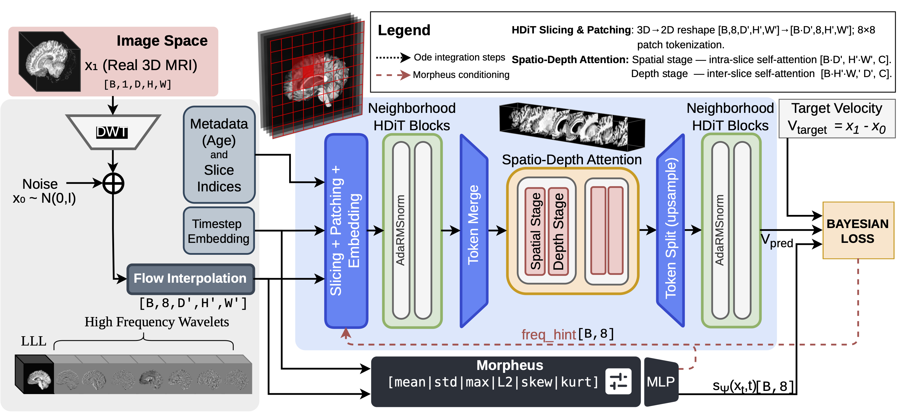

# WaveDiT: Distribution-Aware Wavelet Flow Matching for Efficient 3D Brain MRI Synthesis

<p align="center">
  <a href="https://huggingface.co/spaces/danesed/WaveDiT-demo"></a>
  <a href="https://github.com/sisinflab/WaveDiT/tree/macos-app"></a>
  <a href="https://huggingface.co/danesed/WaveDiT"></a>
  <a href="https://huggingface.co/papers/2606.08670"></a>
  <a href="https://arxiv.org/abs/2606.08670"></a>
</p>

> 🤗 **Try WaveDiT in your browser:** pick an age, generate a synthetic 3D brain MRI, and explore it interactively (triplane + 3D viewer with clip-plane slicing). No install needed &rarr; **[huggingface.co/spaces/danesed/WaveDiT-demo](https://huggingface.co/spaces/danesed/WaveDiT-demo)**

Official PyTorch implementation of *"WaveDiT: Distribution-Aware Wavelet Flow Matching
for Efficient 3D Brain MRI Synthesis"* (MICCAI 2026).

WaveDiT synthesises full resolution, high-fidelity, conditional 3D brain MRIs by performing **flow
matching in the 3D Haar wavelet domain** with a slice-wise **HDiT** backbone, guided by
**Morpheus**, a state-aware uncertainty scheduler that adaptively weights the loss and
sampling across frequency bands.

<p align="center">
  
</p>

**Links:** [🤗 Live demo](https://huggingface.co/spaces/danesed/WaveDiT-demo) ·
[🤗 Models](https://huggingface.co/danesed/WaveDiT) ·
[Project page](https://danesed.github.io/wavedit-page/) ·
[HF paper](https://huggingface.co/papers/2606.08670) ·
[arXiv](https://arxiv.org/abs/2606.08670)

## Key features

- **Wavelet flow matching**: operates on the 8-channel 3D Haar latent (1 LLL + 7 HF bands).
- **Morpheus uncertainty scheduler**: Bayesian heteroscedastic loss weighting + uncertainty-minimising sampling guidance.
- **HDiT backbone**: neighbourhood + spatio-depth factorised attention for efficient 3D modelling.
- **Multiple flow formulations**: `cfm`, `rectified`, `ot_fm`.
- **Conditional synthesis**: numeric and categorical metadata (e.g. age), with classifier-free guidance.
- **Single-file configs**: one YAML fully describes a run; checkpoints are self-contained for generation.

## Morpheus: state-aware uncertainty

Wavelet subbands are not statistically equal: the low-frequency approximation stays close to
Gaussian, while the high-frequency bands are sparse and heavy-tailed, and these statistics
shift along the flow trajectory. **Morpheus** is a lightweight network that, at each step,
reads the statistical signature of the current noisy state (per-band mean, standard
deviation, max amplitude, L2 energy, skewness and kurtosis) and predicts a per-band
log-variance. That prediction plays two roles:

- **Weighting the loss:** it forms a Bayesian heteroscedastic objective
  (`0.5 * exp(-s) * ||v - v_target||^2 + 0.5 * s`) that down-weights inherently unpredictable
  high-frequency content, while the `0.5 * s` term prevents trivial variance inflation. The
  result is state-dependent precision instead of a uniform MSE.
- **Conditioning the backbone:** the projected log-variances become a *frequency hint*,
  injected alongside the time, slice and age embeddings, so the transformer adapts its
  prediction to the current reliability of each band, during both training and sampling.


## Installation

```bash
conda create -n wavedit_env python=3.11 && conda activate wavedit_env
pip install -r requirements.txt
# Optional but recommended: fused neighbourhood-attention CUDA kernels (match your build):
pip install natten -f https://whl.natten.org
# Optional, faster global attention:
# pip install -U xformers
```

Developed for Python 3.11 and PyTorch 2.6 (CUDA recommended).

> **NATTEN is optional.** It is the fastest, ground-truth implementation of the
> neighbourhood attention used in the default config, but WaveDiT ships an
> equivalent built-in pure-PyTorch fallback,
> so the model runs without NATTEN, including on CPU. The backend is chosen
> automatically; override with `WAVEDIT_NA_BACKEND=auto|natten|torch`.

## Repository layout

```
configs/            One YAML per experiment (cfm, rectified, ot_fm)
train.sh            bash train.sh [config.yaml]      -> launches training
generate.sh         bash generate.sh <ckpt> [outdir] -> generates samples
scripts/
  train.py          config-driven training entry point
  generate.py       generation (specific condition sets or linear interpolation)
  prepare_metadata.py  build the metadata CSV from NIfTI folders
tools/
  slim_checkpoint.py   strip optimiser state for release/inference
wavedit/
  config.py         typed config loaded from YAML
  data/             unified dataset (CSV / filename), augmentation, collation
  wavelets/         differentiable 3D Haar DWT/IDWT
  models/           WaveletFlowMatching, DiT3D backbone, Morpheus, sampling, hdit/
  training/         Trainer + checkpoint I/O
  generation/       sample generation
  evaluation/       metrics + W&B visualisation
  utils/            logging + seeding
```

## Data

See [`data/README.md`](data/README.md). In short, build a catalog once:

```bash
python scripts/prepare_metadata.py --input-dirs /path/to/scans --output-csv ./data/dataset.csv
```

then point `data.metadata_csv` in your config at it. Raw scans and catalogs are
git-ignored and must be obtained from the original dataset providers.

## Training

Edit a config (data paths, architecture, hyper-parameters) and launch:

```bash
bash train.sh configs/cfm.yaml
```

Or run the entry point directly:

```bash
PYTHONPATH=. python scripts/train.py configs/cfm.yaml
```

Each run writes to `<checkpoint_dir>/<run_name>/`: `best.pth`, `last.pth`, a copy of the
resolved `config.yaml`, and logs. Set `logging.wandb: true` for W&B metrics and
visualisations. Switch the objective with `model.flow` (`cfm` | `rectified` | `ot_fm`).

## Generation

Checkpoints are self-contained (they embed the config and condition metadata), so
generation needs only the checkpoint and your sampling choices.

```bash
# Specific condition sets (N samples each)
# NOTE: global flags (--cfg-scale, --num-flow-steps, --sampler, --save-size, ...) go BEFORE the subcommand.
PYTHONPATH=. python scripts/generate.py checkpoints/WaveDiT_CFM/best.pth out/ \
    --cfg-scale 1.5 --num-flow-steps 10 --sampler heun --save-size 182 218 182 \
    specific --conditions "age=45.0" "age=70.5" --num-samples 10

# Linearly interpolate one condition (one sample per step)
PYTHONPATH=. python scripts/generate.py checkpoints/WaveDiT_CFM/best.pth out/ \
    linear --condition age --min 6 --max 95 --num 100
```

Or use the launcher: `bash generate.sh checkpoints/WaveDiT_CFM/best.pth`.

| Argument | Meaning |
|---|---|
| `--cfg-scale` | Classifier-free guidance scale (1.0 = none). |
| `--num-flow-steps` | ODE integration steps (overrides the checkpoint default). |
| `--sampler` | `heun` (2nd order) or `euler`. |
| `--morpheus-scale` | Uncertainty-guidance scale (0 disables it). |
| `--save-size` | Center-crop saved volumes to `D H W` (default: full model output). |

## Citation

```bibtex
@misc{danese2026waveditdistributionawarewaveletflow,
      title={WaveDiT: Distribution-Aware Wavelet Flow Matching for Efficient 3D Brain MRI Synthesis},
      author={Danilo Danese and Angela Lombardi and Giuseppe Fasano and Matteo Attimonelli and Tommaso Di Noia},
      year={2026},
      eprint={2606.08670},
      archivePrefix={arXiv},
      primaryClass={cs.CV},
      url={https://arxiv.org/abs/2606.08670},
}
```

## Acknowledgements

WaveDiT builds on the wavelet-domain analysis and multi-level evaluation protocol of our previous work, [FlowLet](https://danesed.github.io/flowlet-page/).

The HDiT backbone is adapted from [k-diffusion](https://github.com/crowsonkb/k-diffusion).

The invertible 3D wavelet transform builds on the great work of [WDM](https://github.com/pfriedri/wdm-3d)

 See `LICENSE`.