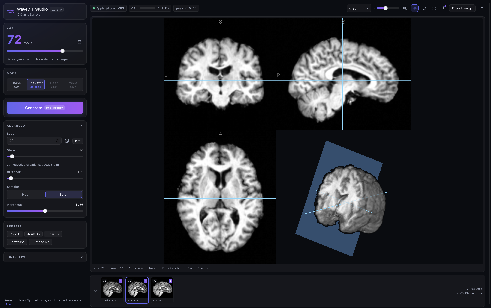

# WaveDiT Studio

A native macOS app for generating and exploring age-conditioned synthetic 3D brain MRI,
entirely on your Mac.

<p align="center">
  
  
  <a href="https://huggingface.co/danesed/WaveDiT"></a>
  <a href="https://arxiv.org/abs/2606.08670"></a>
  <a href="https://danesed.github.io/wavedit-page/"></a>
</p>

<p align="center">
  
</p>

WaveDiT Studio puts [WaveDiT](https://arxiv.org/abs/2606.08670), a wavelet-domain flow
matching model (MICCAI 2026), in a polished desktop app. Pick an age, generate a full
resolution volume on your Mac's GPU (Apple Silicon, PyTorch MPS), and explore it in an
interactive multiplanar and 3D viewer modelled on MRIcroGL. It is native, not an Electron
wrapper: a Python backend on Apple MPS drives a system WebKit window. Everything runs
locally and, after the one-time weights download, fully offline.

> **Research use only.** WaveDiT Studio produces synthetic images for research and
> education. It is not a medical device, provides no diagnostic information, and must not
> be used for clinical decision making.

## Highlights

- **Open on a real brain.** The app launches showing a bundled sample volume, so there is
  never an empty stage, even before any weights are downloaded.
- **Three viewer layouts.** Cycle between a multiplanar strip, a 2x2 grid, and a large 3D
  render. One toggle hides the X, Y and Z crosshair lines and the clip plane for a clean
  3D view.
- **Live accelerator meter.** A fancy GPU/CPU memory meter next to the device chip animates
  while the model is working, alongside the peak-memory badge.
- **Full control.** Age, seed, flow steps, sampler (Euler by default, or Heun), guidance
  scale and Morpheus uncertainty guidance, with a live time estimate.
- **Aging time-lapse.** Sweep an age range with a fixed seed and scrub through the
  synthetic aging trajectory frame by frame.
- **Model manager.** Download official variants, see announced variants (Deep, Wide) as
  "coming soon" placeholders that become downloadable on their own once released, and
  **import your own WaveDiT checkpoint** to try a new config or training set.
- **Library and export.** Every generation is kept with its exact settings; reuse, re-open
  or export any volume as NIfTI (`.nii.gz`).

## Requirements

- Apple Silicon Mac (M1 or newer). Intel Macs are not supported.
- macOS 13 (Ventura) or newer.
- About 2 GB of free disk space for the app, plus the model weights you download
  (roughly 0.5 to 1.5 GB per model variant).
- 16 GB of RAM recommended for comfortable generation.

## Build

Build on the Mac that will run the app (or any Apple Silicon Mac). Only stock macOS tools
are used; Xcode and Homebrew are not required. A Python 3.11 to 3.13 interpreter or
[uv](https://docs.astral.sh/uv/) must be available.

```bash
git clone https://github.com/danesed/WaveDiT.git
cd WaveDiT
git checkout macos-app
./build.sh
```

The script creates a local build venv, verifies the vendored 3D viewer, renders the app
icon, freezes the app with PyInstaller, runs a self check, signs the bundle (ad-hoc) and
produces `dist/WaveDiT-Studio-1.0.0.dmg`.

## Install

1. Open the DMG and drag **WaveDiT Studio** into **Applications**.
2. First launch only: the app is ad-hoc signed (no Apple Developer certificate), so
   Gatekeeper shows a warning. Right-click (or control-click) the app in Applications,
   choose **Open**, then confirm. macOS remembers the choice.
   - Alternative, from a terminal:
     `xattr -dr com.apple.quarantine "/Applications/WaveDiT Studio.app"`

## First run

On first launch the app opens an onboarding panel and offers to download model weights from
[huggingface.co/danesed/WaveDiT](https://huggingface.co/danesed/WaveDiT) with live progress.
Start with **Base**; other variants can be added or removed at any time from the model
manager. Weights are stored under `~/Library/Application Support/WaveDiT Studio/checkpoints`
and are downloaded only once.

## Models

- **Official variants** download from Hugging Face and stay on your Mac.
- **Coming soon** variants (Deep, Wide) appear as transparent placeholders while they are
  still training. Once they are published to `danesed/WaveDiT` the app detects them and
  turns them into normal downloads on its own, with no update required.
- **Import a checkpoint** lets you load any local WaveDiT `.pth` (a new architecture config
  or a model trained on a different dataset). The file is validated as a real WaveDiT
  checkpoint, copied into the app, and listed under "Your models", ready to generate with.

## Dev mode (run from source, any OS)

The backend and UI run unbundled on macOS, Linux or Windows for development. From the
repository root:

```bash
pip install -r requirements.txt
PYTHONPATH=. python -m studio
```

Useful environment variables:

| Variable | Effect |
| --- | --- |
| `WAVEDIT_STUDIO_HEADLESS=1` | Server only, no window; open the printed URL in a browser. |
| `WAVEDIT_STUDIO_DEVICE` | Force `mps`, `cuda` or `cpu` (default: best available). |
| `WAVEDIT_STUDIO_CKPT_DIR` | Use an existing checkpoints directory instead of downloading. |
| `WAVEDIT_STUDIO_DATA_DIR` | Override the data directory (settings, library, exports). |
| `WAVEDIT_STUDIO_PORT` | Fixed server port (default: a random free port). |

`python -m studio --selfcheck` prints versions and the selected device, then exits.
The internal design is documented in [ARCHITECTURE.md](ARCHITECTURE.md).

## Troubleshooting

- **"WaveDiT Studio cannot be opened"**: this is Gatekeeper reacting to the ad-hoc
  signature. Right-click the app, choose **Open**, confirm once. See Install above.
- **First generation is slow**: the model is loading onto the GPU. Subsequent generations
  are much faster.
- **Where is my data?** Everything lives in `~/Library/Application Support/WaveDiT Studio`
  (settings, checkpoints, library, exports). Volumes are plain `.nii.gz` files you can open
  with any NIfTI tool.
- **Reset the app**: quit, then delete that folder. The next launch starts fresh.

## Credits

WaveDiT Studio is designed and built by **Danilo Danese**
([@danesed](https://github.com/danesed)), on top of the official WaveDiT model from
SisInfLab, Politecnico di Bari.

- Paper: [arXiv:2606.08670](https://arxiv.org/abs/2606.08670) /
  [Hugging Face paper page](https://huggingface.co/papers/2606.08670)
- Code: [github.com/sisinflab/WaveDiT](https://github.com/sisinflab/WaveDiT)
- Project page: [danesed.github.io/wavedit-page](https://danesed.github.io/wavedit-page/)
- Models: [huggingface.co/danesed/WaveDiT](https://huggingface.co/danesed/WaveDiT)

```bibtex
@misc{danese2026waveditdistributionawarewaveletflow,
      title={WaveDiT: Distribution-Aware Wavelet Flow Matching for Efficient 3D Brain MRI Synthesis},
      author={Danilo Danese and Angela Lombardi and Giuseppe Fasano and Matteo Attimonelli and Tommaso Di Noia},
      year={2026},
      eprint={2606.08670},
      archivePrefix={arXiv},
      primaryClass={cs.CV},
      url={https://arxiv.org/abs/2606.08670},
}
```

The in-app 3D viewer is [Niivue](https://github.com/niivue/niivue). The HDiT backbone is
adapted from [k-diffusion](https://github.com/crowsonkb/k-diffusion).

App code © Danilo Danese, released under [MIT](LICENSE). The WaveDiT model weights are
licensed CC BY-NC 4.0 (see the [model card](https://huggingface.co/danesed/WaveDiT)).
